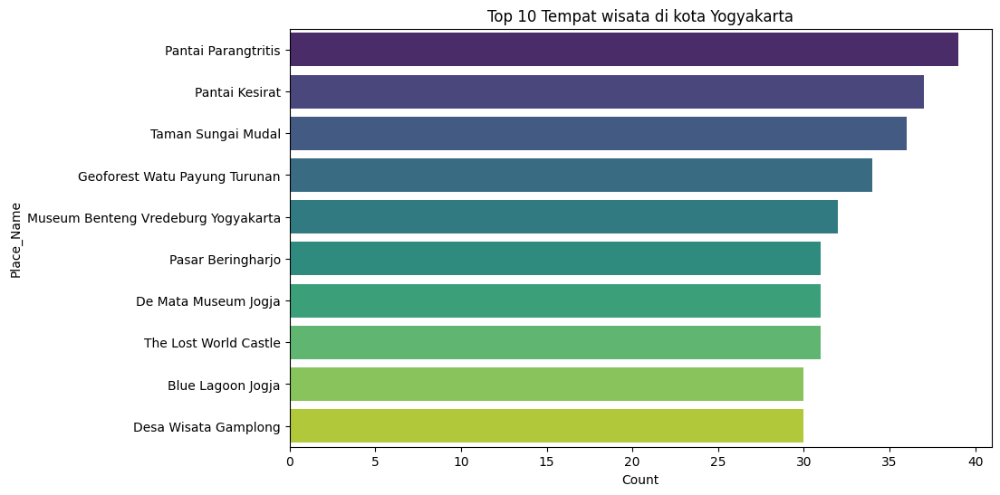
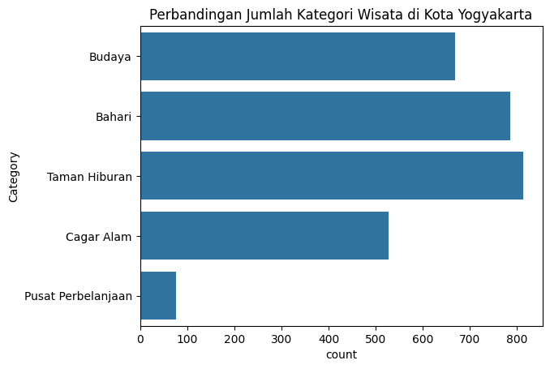
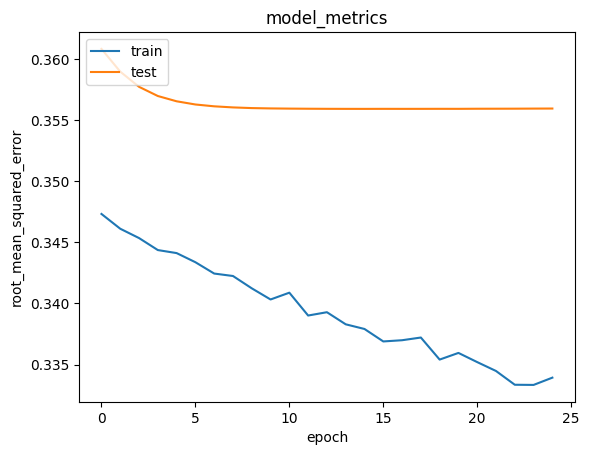

# **Laporan Proyek Machine Learning - Shefiyyah Aurellia Wahyudi** 

## **Sistem-Rekomendasi-Destinasi-Wisata-Kota-Yogyakarta**

## **Project Overview** 
Pengunjung wisata di Kota Yogyakarta terus mengalami peningkatan setiap tahunnya, baik dari wisatawan domestik maupun asing. Hal ini menunjukkan bahwa Daerah Istimewa Yogyakarta merupakan destinasi yang sering dikunjungi oleh para wisatawan untuk berlibur. Provinsi ini memiliki banyak objek wisata yang unik dan menarik, seperti gunung, museum, bukit, pantai, goa, air terjun, budaya, dan tempat bersejarah. Oleh karena itu, pengembangan wisata di kota Yogyakarta perlu dilakukan untuk meningkatkan potensi pariwisata dan pendapatan daerah[1]. 
Pariwisata adalah salah satu sektor penting bagi perekonomian Indonesia. Keindahan alam dan keanekaragaman budaya merupakan nilai lebih yang dianggap dapat menarik para wisatawan. Salah satu kota yang terkenal di Indonesia akan tempat wisatanya adalah Yogyakarta. Menurut data statistik kepariwisataan DIY tahun 2017 sebanyak 25.950.793 wisatawan datang ke Yogyakarta. Berbagai jenis objek wisata mulai dari wisata alam hingga wisata keagamaan ada di Yogyakarta, sehingga banyak dikunjungi wisatawan domestik maupun wisatawan mancanegara[2]. 
Ketika akan berwisata tentu berbagai hal akan menjadi pertimbangan bagi wisatawan, salah satunya adalah membuat rencana perjalanan. Biasanya wisatawan menggunakan jasa agen wisata atau pramuwisata, namun ada juga wisatawan yang merencanakan sendiri tujuan wisatanya, sehingga memerlukan waktu yang lebih banyak untuk mengumpulkan informasi. Informasi yang begitu banyak kadang sering membuat wisatawan bingung dalam memilih tujuan wisatanya[2].  
Berdasarkan masalah tersebut maka dibutuhkan sebuah sistem yang mampu memberikan rekomendasi tempat wisata. Sistem rekomendasi digunakan karena mampu memberikan penyaringan dari informasi yang sangat banyak (overload) di dunia maya untuk memberikan saran/rekomendasi pilihan objek wisata. Perkembangan jumlah informasi yang banyak di dunia maya menyebabkan sulitnya menemukan informasi yang tepat dan sesuai dengan selera/preferensi yang diinginkan wisatawan[2]. 

Pengembangan sistem rekomendasi tempat wisata di Yogyakarta memiliki dampak ekonomi dan pariwisata yang signifikan. Dengan adanya sistem rekomendasi yang akurat dan sesuai dengan preferensi pengguna, diharapkan dapat meningkatkan kunjungan wisatawan ke Yogyakarta. Hal ini akan berdampak positif pada perekonomian daerah, karena peningkatan kunjungan wisatawan akan meningkatkan pendapatan dari sektor pariwisata, termasuk pendapatan dari hotel, restoran, transportasi, dan industri kreatif lokal[2].
## **Business Understanding** 
kebutuhan untuk mengembangkan sistem rekomendasi tempat wisata di Yogyakarta, Indonesia. Hal ini didasari oleh pertumbuhan industri pariwisata di Yogyakarta dan kebutuhan akan rekomendasi yang akurat dan sesuai dengan preferensi pengguna. Dengan adanya sistem rekomendasi ini, diharapkan dapat meningkatkan pengalaman wisatawan dan membantu mereka dalam memilih tempat wisata yang sesuai dengan keinginan mereka. 

    1. Pertumbuhan Industri Pariwisata di Yogyakarta
       Didasari oleh pertumbuhan industri pariwisata di Yogyakarta, yang menunjukkan peningkatan jumlah wisatawan yang datang ke daerah tersebut. Menurut data statistik kepariwisataan DIY tahun 2017, terdapat 25.950.793 wisatawan yang datang ke Yogyakarta. Hal ini menunjukkan pentingnya pengembangan sistem rekomendasi tempat wisata untuk memenuhi kebutuhan wisatawan yang semakin meningkat.

    2. Kebutuhan Akan Rekomendasi Tempat Wisata yang Akurat
       Wisatawan seringkali mengalami kesulitan dalam memilih tujuan wisata karena informasi yang begitu banyak dan bervariasi. Dalam penelitian ini, sistem rekomendasi tempat wisata digunakan untuk memberikan penyaringan dari informasi yang sangat banyak di dunia maya, sehingga dapat memberikan saran atau rekomendasi pilihan objek wisata yang sesuai dengan preferensi wisatawan.

    3. Meningkatkan Pengalaman Wisatawan
       Dengan adanya sistem rekomendasi tempat wisata yang akurat, diharapkan dapat meningkatkan pengalaman wisatawan dalam memilih dan merencanakan perjalanan wisata mereka. Hal ini juga dapat membantu wisatawan yang merencanakan sendiri tujuan wisatanya, sehingga memerlukan waktu yang lebih sedikit untuk mengumpulkan informasi. 

Sistem rekomendasi tempat wisata yang akurat dan sesuai dengan preferensi pengguna di Yogyakarta diharapkan dapat meningkatkan pengalaman wisatawan dan berdampak positif pada industri pariwisata. Berikut adalah penjelasan lebih rinci: 

1. Meningkatkan Pengalaman Wisatawan: 
   a. Penyaringan Informasi: Sistem rekomendasi akan membantu wisatawan dalam memilih tujuan wisata dengan menyaring informasi yang sangat banyak dan bervariasi di dunia maya. Hal ini akan memungkinkan wisatawan untuk mendapatkan rekomendasi pilihan objek wisata yang sesuai dengan preferensi mereka. 
   b. Efisiensi Perencanaan Perjalanan: Dengan adanya sistem rekomendasi, wisatawan akan dapat merencanakan perjalanan wisata mereka dengan lebih efisien. Mereka tidak perlu lagi menghabiskan waktu yang banyak untuk mengumpulkan informasi, karena sistem akan memberikan rekomendasi tempat wisata berdasarkan preferensi mereka. 
   c. Personalisasi Pengalaman: Sistem rekomendasi dapat memberikan rekomendasi yang lebih personal dan sesuai dengan minat dan kebutuhan wisatawan, sehingga dapat meningkatkan kepuasan dan pengalaman wisata mereka.

2. Dampak Terhadap Industri Pariwisata: 
   a. Peningkatan Kunjungan Wisatawan: Dengan adanya sistem rekomendasi yang akurat, diharapkan akan terjadi peningkatan kunjungan wisatawan ke Yogyakarta. Hal ini akan berdampak positif pada pendapatan dari sektor pariwisata, termasuk pendapatan dari hotel, restoran, transportasi, dan industri kreatif lokal. 
   b. Peningkatan Ketersediaan Informasi: Sistem rekomendasi juga dapat membantu dalam mempromosikan berbagai destinasi wisata di Yogyakarta, sehingga dapat meningkatkan eksposur dan ketersediaan informasi mengenai tempat wisata yang mungkin belum terlalu terkenal. 
   c. Peningkatan Keberlanjutan Pariwisata: Dengan meningkatnya kunjungan wisatawan, industri pariwisata.

### Problem Statements
1. Bagaimana penggunaan Model Development dengan Collaborative Filtering  dalam membuat sistem rekomendasi?
2. Berapa akurasi yang dihasilkan dari proses training untuk membuat sistem rekomendasi Destinasi Wisata Kota Yogyakarta?
3. Apakah akurasi yang dihasilkan proses training untuk membuat sistem rekomendasi Destinasi Wisata Kota Yogyakarta termasuk akurat dan baik?
   
### Goals
1. Mendapatkan hasil rekomendasi berdasarkan rating dan kategori 
   memberikan rekomendasi kepada user. Memberikan rekomendasi untuk user dengan id 27. Dari output tersebut, dapat membandingkan antara Tempat wisata di Yogyakarta dengan rating tertinggi dari pengguna dan Top 10 Rekomendasi Tempat wisata di Yogyakarta dari Pengguna.  
    Beberapa Tempat wisata rekomendasi di Yogyakarta menyediakan kategori tempat wisata yang sesuai dengan rating user. Pengguna memperoleh 5 rekomendasi tempat wisata di Yogyakarta dengan kategori ‘Category' Taman Hiburam, 3 rekomendasi tempat wisata di Yogyakarta dengan kategori Budaya, dan 2 tempat wisata di Yogyakarta dengan kategori Cagar Alam. 
2. nilai akurasi val_mse dal val_loss yang dihasilkan oleh model rendah. 
   Dari proses ini memperoleh nilai error akhir sebesar sekitar 0.3339 dan error pada data validasi sebesar 0.3560. 
3. Akurasi nilai mse yang dihasilkan merupakan yang akurat atau baik memiliki kesalahan rendah. 
   proses training model cukup smooth dan model konvergen pada epochs dengan menggunakan callbacks untuk mencapai 'root_mean_squared_error' dan 'val_root_mean_squared_error' terbaik.  Nilai tersebut cukup bagus untuk sistem rekomendasi.

#### Solution statements
- memberikan rekomendasi destinasi wisata berdasarkan prediksi nilai rating baru dengan menggunakan metode  Model Development dengan Collaborative Filtering.
- Sistem membantu wisatawan dalam memilih destinasi wisata di daerah Yogyakarta.
  
## **Data Understanding**
Berikut link Indonesia Tourism Destination dari kaggle: https://www.kaggle.com/datasets/aprabowo/indonesia-tourism-destination 

- Import library pandas, matplotlib.pyplot, seaborn.
- Load Data dari folder dataset
    - tourism_with_id.csv : mengandung informasi tempak wisata di 5 kota besar di Indonesia (hanya kota Yogyakarta yang dipakai) 
    - user.csv : mengandung informasi pengguna untuk membuat rekomendasi fitur berdasar pengguna 
    - tourism_rating.csv : mengandung informasi pengguna, tempat wisata, dan rating untuk membuat sistem rekomendasi berdasar rating
- Melakukan Univariate Exploratory Data Analysis:
    - Pada **destination_rating** terdapat:
      - terdiri dari 3 kolom yaitu: User_Id, Place_Id, dan Place_Ratings
      - terdiri dari 10000 input
    - Pada **destination** terdapat:
      - terdiri dari 13 kolom yaitu: Place_Id, Place_Name, Description, Category, City, Price, Rating, Time_Minutes, Coordinate, Lat, Long, Unnamed: 11, dan Unnamed: 12 
        Dan setelah dilihat bahwa terdapat kolom dengan nama yang tidak jelas seperti  Unnamed: 11, Time_Minutes, dan  Unnamed: 12 dan memiliki nilai yang kosong seperti Unnamed: 11 dan Time_Minutes
      - terdiri dari 437 data input
        Dan setelah dilihat lagi dari fungsinya kolom Unnamed: 11 dan Unnamed: 12 tidak akan digunakan atau dihapus karena memiliki banyak nilai kosong dan fungsi dari kedua kolom tidak penting
    - Pada **user** terdapat:
        - terdiri dari 3 kolom yaitu: User_Id, Location, dan Age
        - terdiri dari 300 input
## **Data Preparation**
- **Menangani missing value dan kolom yang tidak diperlukan pada tabel destination**
  -  Menghapus kolom Unnamed: 11, Time_Minutes	dan Unnamed: 12. Dengan menghapus kolom ini dapat Menangani missing value dan kolom yang tidak diperlukan
  -  Menggabungkan tabel destination dengan destination_rating menjadi tabel merge_destination
  - Mengganti merge_destination denga merge_destination yang hanya city di 'Yogyakarta' untuk mengetahui sistem rekomendasi wisata di Yogyakarta
-  Destinasi wisata yang termasuk kedalam top 10 paling sering dikunjungi menggunakan value count:
     
- Kategori tempat wisata yang terbanyak sampai yang paling sedikit jumlah pengunjungnya menggunakan plot:
     
- Membuat dictionary untuk data ‘Place_Id’, 'Place_Name’, dan ‘Category’
- Membuang data duplikat pada variabel preparation agar nama wisata pada yang muncul pada saat menggunakan model tidak ada yang sama atau duplikat 

Selanjutnya, bagi data train dan validasi dengan komposisi 80:20. Namun sebelumnya perlu memetakan (mapping) data user dan tempat_wisata menjadi satu value terlebih dahulu. Lalu, buatlah rating dalam skala 0 sampai 1 agar mudah dalam melakukan proses training.  

## **Modeling**

### **Model Development dengan Collaborative Filtering**
- Selanjutnya,  lakukan load data di awal dan membaca file **tourism_rating.csv**. Saat itu, membuat variabel destination_rating dan menetapkan data pada variabel tersebut. Untuk memudahkan, ubah nama variabel destination_rating menjadi df. 
- Memahami data rating yang dimiliki.
- Menyandikan (encode) fitur ‘User_Id’ dan ‘Place_Id’ ke dalam indeks integer. 
- Memetakan ‘User_Id’ dan ‘Place_Id’ ke dataframe yang berkaitan.
- Mengecek beberapa hal dalam data seperti jumlah user, jumlah tempat wisata, kemudian mengubah nilai rating menjadi float. 

#### **Proses Training**
- Pada tahap ini, model menghitung skor kecocokan antara pengguna dan tempat wisata dengan teknik embedding. Pertama, melakukan proses embedding terhadap data user dan tempat wisata. Selanjutnya, lakukan operasi perkalian dot product antara embedding user dan tempat wisata. Selain itu, dapat menambahkan bias untuk setiap user dan tempat wisata. Skor kecocokan ditetapkan dalam skala [0,1] dengan fungsi aktivasi sigmoid. Di sini, membuat class *RecommenderNet* dengan **keras Model class**. Kode class RecommenderNet ini terinspirasi dari tutorial dalam situs **Keras** dengan beberapa adaptasi sesuai kasus yang sedang diselesaikan.
- Selanjutnya, lakukan proses compile terhadap model.
- Model ini menggunakan  Mean Squared Error untuk menghitung loss function, Adam (Adaptive Moment Estimation) sebagai optimizer, early_stopping_loss untuk mencari val_loss dan val_root_mean_squared_error terendah, dan root mean squared error (RMSE) sebagai metrics evaluation. 

**Hasil sistem rekomendasi tempat wisata di Yogyakarta menunjukkan hasil sebagai berikut**: 

####          Menunjukan Rekomendasi untuk id pengguna: 27              

#####  Tempat Wisata di Yogyakarta dengan Rating tertinggi dari Pengguna
|        Nama Tempat Wisata      |      Kategori Tempat Wisata        |
|  ----------------------------  |    ------------------------------- |
|        Tugu Pal Putih Jogja    |            Taman Hiburan           |
|     Jurang Tembelan Kanigoro   |            Taman Hiburan           |
|               Pantai Sundak    |                Bahari              |

#####                      Top 10 Rekomendasi Tempat Wisata di Yogyakarta          

|             Nama Tempat Wisata                 |      Kategori Tempat Wisata        |
|       ---------------------------------------  | ---------------------------------  |
|             Desa Wisata Gamplong               |            Taman Hiburan           |
|          Museum Benteng Vredeburg Yogyakarta   |                Budaya              |
|                  Monumen Yogya Kembali         |                Budaya              |
|                     Monumen Sanapati           |                Budaya              |
|              Kampung Wisata Taman Sari         |            Taman Hiburan           |
|                    Sumur Gumuling              |            Taman Hiburan           |
|       Puncak Gunung Api Purba - Nglanggeran    |              Cagar Alam            |
|             Bukit Bintang Yogyakarta           |            Taman Hiburan           |
| The World Landmarks - Merapi Park Yogyakarta   |            Taman Hiburan           |
|               Bukit Wisata Pulepayung          |              Cagar Alam            |

Pada tabel diatas:

- Berhasil memberikan rekomendasi kepada user. Sebagai contoh, hasil di atas adalah rekomendasi untuk user dengan id 27. Dari output tersebut, dapat membandingkan antara Tempat wisata di Yogyakarta dengan rating tertinggi dari pengguna dan Top 10 Rekomendasi Tempat wisata di Yogyakarta dari Pengguna.  
- Beberapa Tempat wisata rekomendasi di Yogyakarta menyediakan kategori tempat wisata yang sesuai dengan rating user. Pengguna memperoleh 5 rekomendasi tempat wisata di Yogyakarta dengan kategori ‘Category' Taman Hiburam, 3 rekomendasi tempat wisata di Yogyakarta dengan kategori Budaya, dan 2 tempat wisata di Yogyakarta dengan kategori Cagar Alam. 

  
## Evaluation 

Untuk melihat visualisasi proses training, plot metrik evaluasi dengan matplotlib 

$$   $$

Proses training model cukup smooth dan model konvergen pada epochs dengan menggunakan callbacks untuk mencapai 'root_mean_squared_error' dan 'val_root_mean_squared_error' terbaik. Dari proses ini memperoleh nilai error akhir sebesar sekitar 0.3339 dan error pada data validasi sebesar 0.3560.  Selain itu, plot metrik menghasilkan goodfit untuk, Nilai tersebut cukup bagus untuk sistem rekomendasi. 

### **Referensi** 
[1]	A. Hanafi Ahmad, “Pengaruh Jumlah Kunjungan Wisatawan, Objek Wisata, Dan Retribusi Pariwisata Terhadap Pendapatan Asli Daerah,” J. Sos. Ekon. Bisnis, vol. 2, no. 1, pp. 50–61, 2022, doi: 10.55587/jseb.v2i1.34. 

[2]	A. S. N. S. Ningrum, “Content Based Dan Collaborative Filtering Pada Rekomendasi Tujuan Pariwisata Di Daerah Yogyakarta,” Telematika, vol. 16, no. 1, p. 44, 2019, doi: 10.31315/telematika.v16i1.3023.

